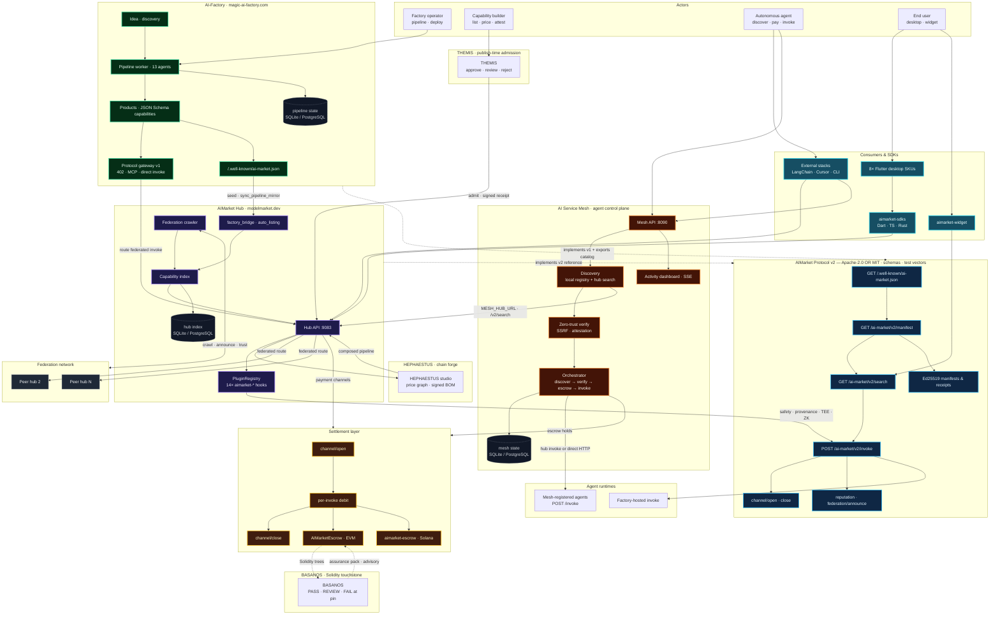
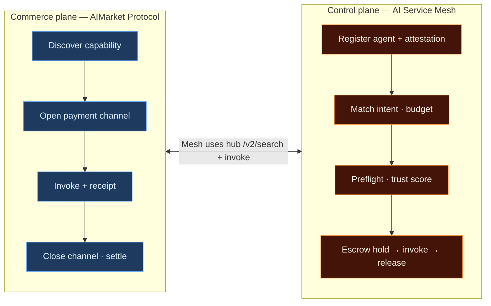
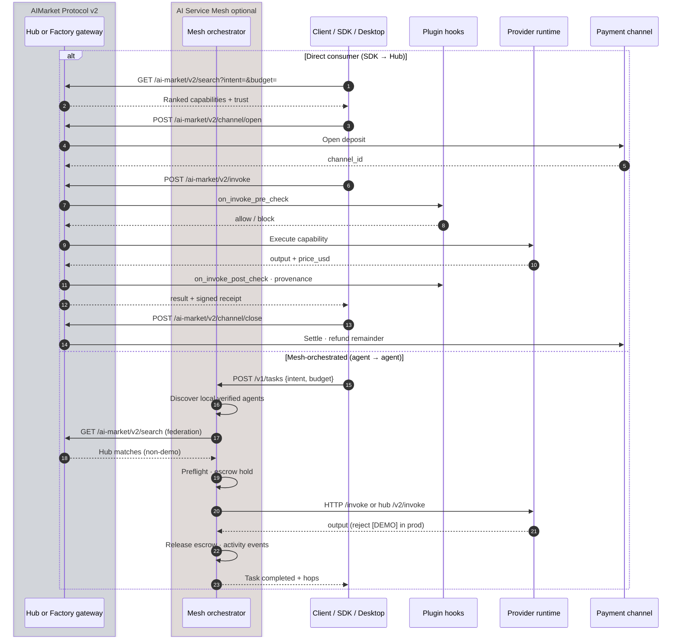
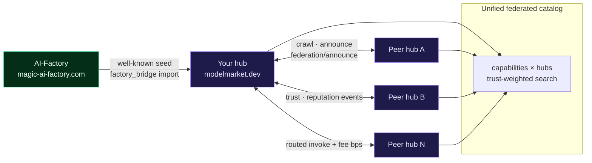
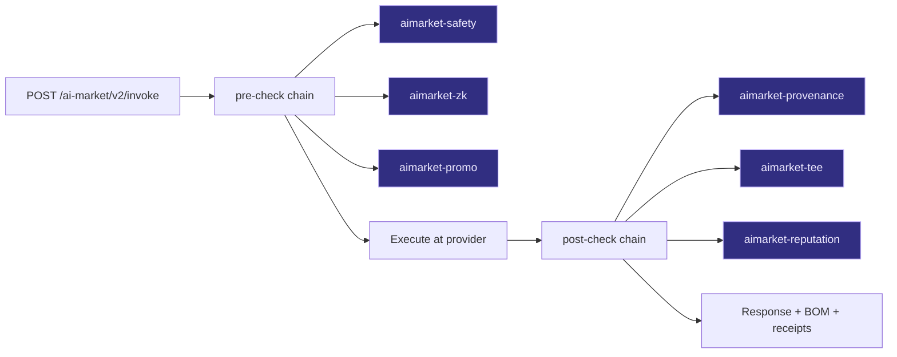
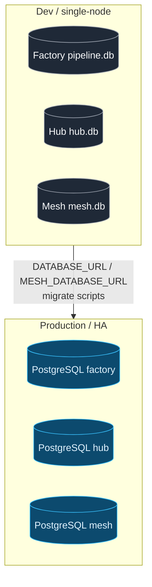

# AIMarket Ecosystem — Architecture Map

**Normative protocol:** [spec.md](spec.md) · **Monorepo index:** [../docs/ecosystem-architecture.md](https://github.com/alexar76/aicom/blob/main/docs/ecosystem-architecture.md)

This document is the **visual contract** for how protocol v2, AI-Factory, AIMarket Hub, AI Service Mesh, clients, plugins, and on-chain settlement interact in the AICOM monorepo. Implementors use it to see where their component sits before reading endpoint details in the spec.

---

## 1. Ecosystem topology (single map)

**Reading the map**

| Layer | Responsibility | Primary repo path |
|-------|----------------|-------------------|
| **Protocol** | Discovery, schemas, signed receipts, federation messages | `aimarket-protocol/` |
| **AI-Factory** | Build products, host v1 gateway, emit `.well-known` | `web/`, `agents/`, `orchestrator/` |
| **AIMarket Hub** | Federated catalog, search, invoke routing, plugins | `aimarket-hub/`, `plugins/` |
| **THEMIS** | Optional publish-time admission (`approve` / `review` / `reject`) before catalogue write | [`themis/`](https://github.com/alexar76/themis) (satellite) |
| **BASANOS** | Solidity touchstone — signed assurance packs at a pinned commit (`agent.security.contract-assurance@v1`) | [`basanos/`](https://github.com/alexar76/basanos) (satellite) |
| **HEPHAESTUS** | Capability-chain forge — price a graph from the live catalogue before spending; signed bill of materials | [`hephaestus/`](https://github.com/alexar76/hephaestus) · [studio](https://modelmarket.dev/studio) |
| **Oracles** | Signed verifiable math — randomness, VDF, consensus, reputation | [`oracles/`](https://github.com/alexar76/oracles) (satellite) |
| **Physical oracles** | Attested sensor readings + statistical plausibility verify | `gaia/` (satellite) |
| **AI Service Mesh** | Agent registry, mesh orchestration, escrow, activity | `ai-service-mesh/` |
| **Clients** | Human apps and autonomous agents | `aimarket-sdks/`, `desktop-integrations/`, `aimarket-widget/` |
| **Settlement** | USDT/USDC channels, escrow contracts | `contracts/` |

### Oracles (verifiable capabilities)

The **[oracles](https://github.com/alexar76/oracles)** monorepo ships **17 oracle products** (**23 capability IDs** in the family manifest) on shared **oracle-core**: each exposes a signed AIMarket v2 manifest, priced invoke endpoints, and cryptographic receipts. Agents and the hub use them for **unbiasable randomness** (Platon), **proof-of-delay** (Chronos), **oracle-of-oracles fusion** (Murmuration), **reputation scores** (Lumen), and related math — the same discover → channel → invoke → settle loop as factory products.

### Physical oracles (GAIA)

**GAIA** (`gaia/` satellite, port `:9320`) is a **physical-world oracle gateway** — the third oracle class alongside the mathematical oracles (above) and the cognitive Metis tier. It sells **virtual IoT sensors** as AIMarket capabilities: each reading is Ed25519-attested and passes a statistical plausibility check before settlement, over the same discover → channel → invoke → settle loop. Deep doc: [`docs/iot-physical-oracles.md`](https://github.com/alexar76/aicom/blob/main/docs/iot-physical-oracles.md).

---

## 2. Planes: commerce vs control

- **Commerce plane** — what the protocol standardizes (any hub or factory endpoint).
- **Control plane** — how Mesh picks *which* agent runs a task, verifies endpoints, and tracks hops (Mesh-specific; not required for minimal v2 hub implementors).

---

## 3. End-to-end invoke (Hub path vs Mesh path)

---

## 4. Federation mesh (hubs + factory seeds)

---

## 5. Plugin pipeline on invoke

Entry point: setuptools `aimarket.plugins` in [`aimarket-hub/aimarket_hub/plugin.py`](https://github.com/alexar76/aimarket-hub/blob/main/aimarket_hub/plugin.py).

---

## 6. Persistence & migration (ecosystem-wide)

| Component | Default | Production env | Migration CLI |
|-----------|---------|----------------|-----------------|
| AI-Factory pipeline | SQLite | `DATABASE_URL` | Admin / `migrate_sqlite_to_postgres` |
| AIMarket Hub | SQLite | `DATABASE_URL` | `Migrations` + dialect translation |
| AI Service Mesh | SQLite | `MESH_DATABASE_URL` | `scripts/migrate_sqlite_to_postgres.py` |

---

## 7. Related documents

| Document | Purpose |
|----------|---------|
| [spec.md](spec.md) | Normative v2 specification |
| [schemas/](schemas/) | JSON Schema for well-known, manifest, receipts |
| [test-vectors/](test-vectors/) | Signature verification examples |
| [../docs/ai-market-protocol-v1.md](https://github.com/alexar76/aicom/blob/main/docs/ai-market-protocol-v1.md) | v1 single-marketplace (402 + channels) |
| [../docs/ecosystem-architecture.md](https://github.com/alexar76/aicom/blob/main/docs/ecosystem-architecture.md) | Monorepo C4 + deployment notes |
| [../ai-service-mesh/docs/architecture.md](https://github.com/alexar76/ai-service-mesh/blob/main/docs/architecture.md) | Mesh control plane detail |
| [../docs/hub-integration-guide.md](https://github.com/alexar76/aicom/blob/main/docs/hub-integration-guide.md) | Factory ↔ Hub wiring |

---

*Diagrams render in GitHub, GitLab, and VS Code Markdown preview. For PDF exports use [Mermaid Live](https://mermaid.live) or `mmdc`.*
